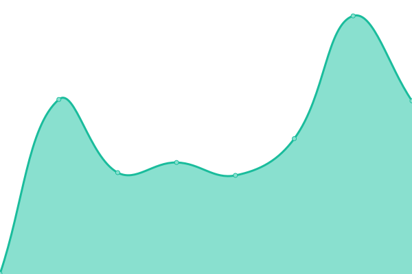

# [📈 Live Status](https://demo.upptime.js.org): <!--live status--> **🟧 Partial outage**

This repository contains the open-source uptime monitor and status page for [Edge](https://demo.upptime.js.org), powered by [Upptime](https://github.com/upptime/upptime).

With [Upptime](https://upptime.js.org), you can get your own unlimited and free uptime monitor and status page, powered entirely by a GitHub repository. We use [Issues](https://github.com/omxpro/dozen-cord-status/issues) as incident reports, [Actions](https://github.com/omxpro/dozen-cord-status/actions) as uptime monitors, and [Pages](https://demo.upptime.js.org) for the status page.

<!--start: status pages-->
<!-- This summary is generated by Upptime (https://github.com/upptime/upptime) -->
<!-- Do not edit this manually, your changes will be overwritten -->
<!-- prettier-ignore -->
| URL | Status | History | Response Time | Uptime |
| --- | ------ | ------- | ------------- | ------ |
|  [DozenCord Web Client](http://173.208.153.242:1131) | 🟥 Down | [dozen-cord-web-client.yml](https://github.com/omxpro/dozen-cord-status/commits/HEAD/history/dozen-cord-web-client.yml) | 

 0ms
     
 | 

<a href="https://omxpro.github.io/dozen-cord-status/history/dozen-cord-web-client">0.00%</a>
    

|  [DozenCord Status Page](https://github.com/omxpro/dozen-cord-status) | 🟩 Up | [dozen-cord-status-page.yml](https://github.com/omxpro/dozen-cord-status/commits/HEAD/history/dozen-cord-status-page.yml) | 

 640ms
     
 | 

<a href="https://omxpro.github.io/dozen-cord-status/history/dozen-cord-status-page">0.00%</a>
    

|  [DozenCord CDN](https://cdn.dozen-cord.cf) | 🟥 Down | [dozen-cord-cdn.yml](https://github.com/omxpro/dozen-cord-status/commits/HEAD/history/dozen-cord-cdn.yml) | 

 0ms
     
 | 

<a href="https://omxpro.github.io/dozen-cord-status/history/dozen-cord-cdn">0.00%</a>
    

|  [Fosscord-server official unstable site](http://dev.fosscord.com) | 🟥 Down | [fosscord-server-official-unstable-site.yml](https://github.com/omxpro/dozen-cord-status/commits/HEAD/history/fosscord-server-official-unstable-site.yml) | 

 177ms
     
 | 

<a href="https://omxpro.github.io/dozen-cord-status/history/fosscord-server-official-unstable-site">0.00%</a>
    

<!--end: status pages-->

[**Visit our status website →**](https://demo.upptime.js.org)

## 📄 License

- Powered by: [Upptime](https://github.com/upptime/upptime)
- Code: [MIT](./LICENSE) © [Edge](https://demo.upptime.js.org)
- Data in the `./history` directory: [Open Database License](https://opendatacommons.org/licenses/odbl/1-0/)
